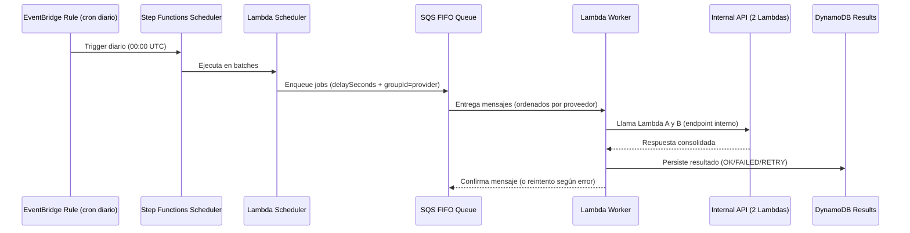

# TAPI Challenge — AWS serverless, 1M+ jobs/day

> Arquitectura y código base para resolver el desafío técnico: ejecutar **una consulta diaria por registro** (1M+), **distribuida a lo largo del día**, **persistiendo resultados**, con **reintentos inteligentes**, y **sin concurrencia por proveedor** usando AWS serverless. 【7†source】

---

## ✅ Objetivos
- Ejecutar N consultas por día (N≈1M, escalable).
- Distribuir los llamados durante 24h (sin “picos”).
- Persistir resultados y auditoría.
- Manejo de errores con política de reintentos diferenciada (5xx vs 4xx).
- Evitar concurrencia por proveedor.

## 🧭 Suposiciones y alcance de este análisis

- **Tamaño del `body` desconocido** en la fuente original. Para esta versión **encolamos el `body` directamente en SQS** y lo procesamos en la **Lambda Worker** (sin puntero S3), ya que simplifica el flujo y cumple con el requerimiento del challenge.
- **Límites relevantes**: SQS admite hasta **256 KB** por mensaje (incluyendo atributos) y DynamoDB hasta **400 KB** por ítem. Si el `body` creciera por encima de ~200 KB, **esta solución debería evolucionar** al *pattern* de **puntero S3** (almacenar el payload en S3 y encolar una referencia). **Este ajuste queda fuera del alcance de este análisis** pero se documenta como *Next Step* recomendado.
- **Parseo JSON**: se realiza en la Lambda de manera **sincrónica** (`JSON.parse`), aceptando el costo de CPU p95 asociado. Si aparecieran payloads grandes, se deberá: (1) adoptar punteros S3 + *streaming*, o (2) aumentar memoria/CPU y/o usar parseo parcial.

## 🏗️ Arquitectura de infraestructura

```mermaid
flowchart LR
  A[Registros (DynamoDB/RDS)] -->|Step Functions (scheduler diario)| B[SQS FIFO (jobs)]
  subgraph "Procesamiento"
    B --> C[Lambda Worker]
    C --> D[API Interna (2 Lambdas)]
    C --> E[(Resultados + Logs - DynamoDB)]
  end
  B -.-> DLQ((DLQ))
```

## 🔄 Flujo de trabajo diario



## 🔧 Decisiones clave
- **No concurrencia por proveedor**: garantizada por **SQS FIFO** + `messageGroupId = provider`.
- **Distribución 24h**: cálculo de _delay_ al _enqueue_ para cada mensaje (ej. `second = floor(i * (86400/N))`).
- **Idempotencia**: `deduplicationId = jobId@YYYY-MM-DD` para no duplicar en reintentos.
- **Backoff**: reintentos exponenciales para `5xx`/timeouts; **no reintentar** `4xx` de validación.
- **Observabilidad**: métricas por proveedor (tasa, error rate, p95), alarmas en DLQ>0.

## 🗃️ Modelo de datos (DynamoDB)
**Table `Records`**
```json
{ "pk": "REC#<id>", "sk": "REC#<id>", "id": "<uuid>", "provider": "provA", "endpoint": "/v1/foo",
  "body": {...}, "active": true }
```
GSI1: `provider` → listar por proveedor (para rate limiting específico si se requiere).

**Table `Results`**
```json
{ "pk": "RES#<id>#<date>", "sk": "RES#<id>#<date>",
  "id": "<uuid>", "date": "2025-08-12", "status": "OK|RETRY|FAILED",
  "httpStatus": 200, "latencyMs": 1234, "payload": {...}, "error": {...} }
```

## 🧮 Capacidad y costos (orden de magnitud)
- 1M/día ≈ **~11.6 mensajes/seg** en promedio (picos controlados por delay SQS).
- **Lambda**: milisegundos por job → costos lineales a duración. **SQS on-demand**, **DynamoDB on-demand**.

## 🚦 Políticas de reintento
- **Reintentar**: `HTTP 5xx`, `429`, timeouts, fallas de red → backoff exponencial, jitter.
- **No reintentar**: `HTTP 4xx` semánticos (p.ej., `400` validación) → enviar a `Results` con `FAILED` y a DLQ si se configura política estricta.
- **Circuit breaking** opcional por proveedor si se detecta degradación.

## 🧭 Runbook (operaciones)
- **Alertas**: DLQ>0, errores 5xx sostenidos, latencia p95>piso.
- **Borrado DLQ**: inspección → re-enqueue manual con tooling.
- **Feature flags**: desactivar proveedores problemáticos sin redeploy (flag en `Records` o config table).

---

## 📎 Apéndice A — Resiliencia (timeouts, retries y jitter)

- **Política de reintentos diferenciada**: reintentar `5xx/429/timeouts`; no reintentar `4xx` semánticos. Uso de **DLQ** para casos persistentes.
- **Backoff con jitter**: para evitar *retry storms* y sincronización de clientes, aplicar **exponential backoff + jitter** en componentes que hagan auto-retry. Referencia: *Amazon Builders' Library – Timeouts, retries and backoff with jitter* (Marc Brooker).

## 📚 Apéndice B — Investigación y fundamentos (Lambda & SQS)

**Serverless / AWS Lambda**
- *Cloud Programming Simplified: A Berkeley View on Serverless Computing* (UC Berkeley, 2019).  
  - https://arxiv.org/abs/1902.03383
- *Serverless in the Wild* (USENIX ATC 2020).  
  - https://www.usenix.org/system/files/atc20-shahrad.pdf
- *Peeking Behind the Curtains of Serverless Platforms* (USENIX ATC 2018).  
  - https://www.usenix.org/system/files/conference/atc18/atc18-wang-liang.pdf

**Mensajería / SQS**
- *Interactive Use of Cloud Services: Amazon SQS and S3* (CMU, 2012).  
  - https://istc-cc.cmu.edu/publications/papers/2012/interactive-use-of-clouds.pdf
- *Performance modeling of cloud apps using Message Queueing as a Service (MaaS)* (2017).  
  - https://www.researchgate.net/publication/316174465_Performance_modeling_of_cloud_apps_using_message_queueing_as_a_service_MaaS
- *Amazon Builders' Library – Timeouts, retries and backoff with jitter*.  
  - https://aws.amazon.com/builders-library/timeouts-retries-and-backoff-with-jitter/

> Estos trabajos respaldan la elección de **Lambda + SQS** para cargas masivas con aislamiento por evento, *autoscaling* y control de concurrencia (FIFO `messageGroupId`), y fundamentan el diseño de **reintentos con jitter** para evitar fallas correlacionadas.

---

**Licencia:** MIT • Autor: Tu Nombre